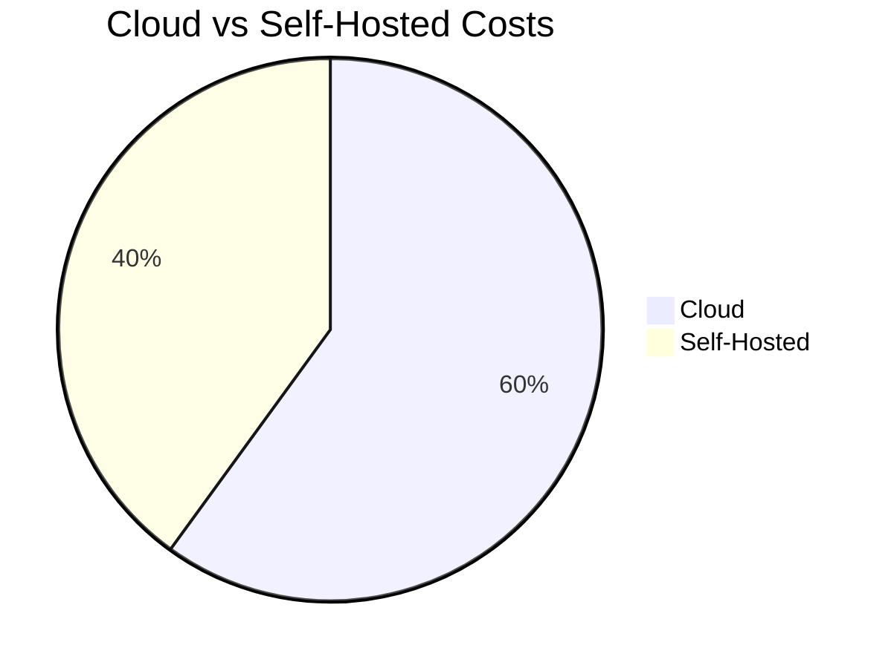

Given the constraints, I'll provide a refined outline with bullet points for each slide and suggest how Mermaid diagrams could enhance the presentation. Since I can't execute or display actual Mermaid diagrams here, I'll describe the diagram type that could complement each slide's content.

### Slide 1: Introduction to a DevOps Evolution
- **Bullet Points**:
  - Background: Who I am and my journey in DevOps.
  - Objective: Sharing a revolutionary approach combining GitOps, CI/CD, and self-hosting.
- **Mermaid Diagram**: None needed. Personal introduction slide.

### Slide 2: The Case for Self-Hosting
- **Bullet Points**:
  - Comparison: Cloud vs. self-hosted solutions.
  - Benefits: Control, cost savings, and customization.
- **Mermaid Diagram**: Pie chart showing cost distribution in cloud vs. self-hosted setups.



### Slide 3: Building on Three Pillars
- **Bullet Points**:
  - Pillar 1: GitOps for automated infrastructure management.
  - Pillar 2: CI/CD for seamless software delivery.
  - Pillar 3: Self-hosting for maximum control.
- **Mermaid Diagram**: Flowchart showing the interaction between the three pillars.

  ```mermaid
  graph TD;
    A[GitOps] --> B[CI/CD];
    B --> C[Self-Hosting];
    C --> A;
  ```

### Slide 4: Visualizing Our Infrastructure
- **Bullet Points**:
  - Core Components: GitHub, GitHub Actions, Self-hosted Servers.
  - Integration: How these components work together.
- **Mermaid Diagram**: Flowchart detailing infrastructure components.

  ```mermaid
  graph LR;
    GitHub -->|Triggers| GitHubActions[GitHub Actions];
    GitHubActions -->|Deploys to| SelfHosted[Self-hosted Servers];
  ```

### Slide 5: Automating with GitOps
- **Bullet Points**:
  - Example: Automated testing workflow.
  - Impact: Faster feedback loops, reduced manual errors.
- **Mermaid Diagram**: Sequence diagram for a GitOps workflow.

  ```mermaid
  sequenceDiagram
    participant Dev as Developer
    participant GH as GitHub
    participant GA as GitHub Actions
    Dev->>GH: Push code
    GH->>GA: Trigger workflow
    GA->>GA: Run tests
  ```

### Slide 6: Mastering CI/CD with GitHub Actions
- **Bullet Points**:
  - YAML configuration for deployment pipeline.
  - Benefits: Dynamic provisioning, multi-stage deployments.
- **Mermaid Diagram**: Gantt chart showing stages of CI/CD pipeline.

  ```mermaid
  gantt
    title CI/CD Pipeline Stages
    section Build
    Compile: done, 1, 30m
    Test: active, 2, 1h
    section Deploy
    Deploy to Staging: 3, 2h
    Health Check: 4, 30m
  ```

### Slide 7: The Backbone: Self-Hosted Infrastructure
- **Bullet Points**:
  - Server specs, network setup, Kubernetes clusters.
  - Visualization: Infrastructure layout.
- **Mermaid Diagram**: Graph showing server and network architecture.

  ```mermaid
  graph TD;
    LoadBalancer --> Server1[Server 1];
    LoadBalancer --> Server2[Server 2];
    Server1 --> DB[(Database)];
    Server2 --> DB;
  ```

### Slide 8: Managing DevOps On-the-Go
- **Bullet Points**:
  - Tools: iOS Shortcuts and Working Copy.
  - Scenario: Managing CI/CD pipelines remotely.
- **Mermaid Diagram**: None needed. Screenshots or app interfaces are more appropriate here.

### Slide 9: Challenges & Triumphs
- **Bullet Points**:
  - Scaling issues and solutions.
  - Problem-Solution-Outcome format.
- **Mermaid Diagram**: Before-and-after flowchart or state diagram illustrating solutions.
 
  ```mermaid
  graph TB;
    Problem[Scaling Issue] --> Solution[Implemented Solution];
    Solution --> Outcome[Successful Scaling];
  ```

### Slide 10: Success in Action
- **Bullet Points**:
  - Case study: Deployment speed improvements.
  - Results: Before-and-after metrics.
- **Mermaid Diagram**: Bar chart comparing metrics.
 
  ```mermaid
  bar
    title Deployment Times
    "Before": 120
    "After": 45
  ```

### Slide 11: What's Next?
- **Bullet Points**:
  - Future tech explorations: AI in DevOps.
  - Potential tool integrations.
- **Mermaid Diagram**: Concept map exploring future directions.
 
  ```mermaid
  graph TD;
    Current[Current Tech] --> AI[AI in DevOps];
    Current --> NewTools[New Tool Integrations];
  ```

### Slide 12: Engaging with the Ecosystem
- **Bullet Points**:
  - How to participate: Open-source projects, forums.
  - QR codes to resources.
- **Mermaid Diagram**: None needed. QR codes and links would suffice.

### Slide 13: Invitation to Innovate
- **Bullet Points**:
  - Call to action: Experiment with self-hosted GitOps.
  - Takeaway: Starter toolkit guide.
- **Mermaid Diagram**: None needed. Provide a QR code to the toolkit or guide.

### Slide 14: Dialogue and Discovery
- **Bullet Points**:
  - Open floor for questions.
  - Prompt: "What's your biggest DevOps challenge?"
- **Mermaid Diagram**: None needed. Interactive Q&A session.

For Mermaid diagrams, adjust the code to fit your specific scenarios or data. These descriptions and Mermaid diagram suggestions aim to provide a solid foundation for creating engaging, informative slides that capture the essence of your infrastructure and practices.