Certainly! Here's an enhanced outline with more detailed bullet points and Mermaid diagram suggestions for each slide:

### Slide 1: Embarking on a DevOps Revolution
- **Bullet Points**: 
  - Personal journey: From traditional DevOps to pioneering a unique approach
  - Key realization: The untapped potential of combining GitOps, CI/CD, and self-hosting
  - Objective: Inspiring the audience to rethink their DevOps strategies
- **Mermaid Diagram**: A timeline illustrating personal DevOps journey milestones

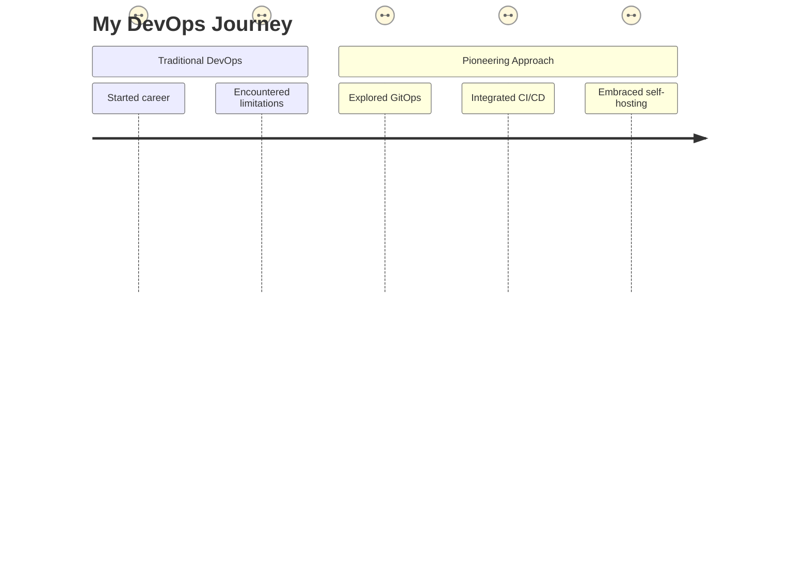

### Slide 2: Unveiling the Power of Self-Hosting
- **Bullet Points**:
  - Pain points of relying solely on cloud providers
  - Self-hosting advantages: Enhanced control, security, and customization
  - Debunking myths: Addressing concerns about complexity and maintenance
- **Mermaid Diagram**: A comparison matrix of cloud vs. self-hosted features

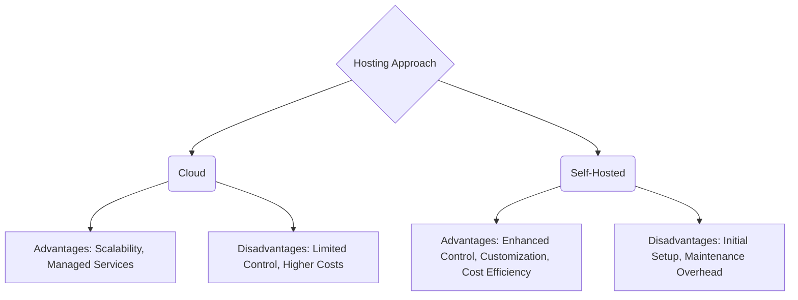

### Slide 3: The Trifecta: GitOps, CI/CD, and Self-Hosting
- **Bullet Points**:
  - GitOps: Declarative infrastructure and application management
  - CI/CD: Automating the software delivery lifecycle
  - Self-hosting: Taking control of the infrastructure
  - Synergy: How these pillars complement each other
- **Mermaid Diagram**: A Venn diagram showcasing the intersection of the three pillars

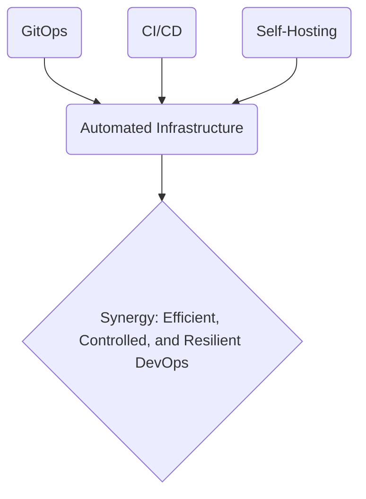

### Slide 4: Diving into Our Infrastructure Blueprint
- **Bullet Points**:
  - GitHub: The hub for version control and collaboration
  - GitHub Actions: Enabling seamless CI/CD workflows
  - Self-hosted servers: The foundation of our infrastructure
  - Kubernetes: Orchestrating containerized applications at scale
- **Mermaid Diagram**: An infrastructure overview diagram

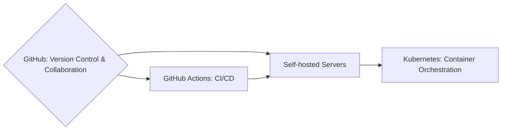

### Slide 5: Unleashing the Magic of GitOps with GitHub Actions
- **Bullet Points**:
  - Real-world examples: Automated testing, building, and deployment
  - Benefits in action: Consistency, traceability, and efficiency
  - Lessons learned: Best practices for implementing GitOps
- **Mermaid Diagram**: A sequence diagram illustrating a GitOps workflow

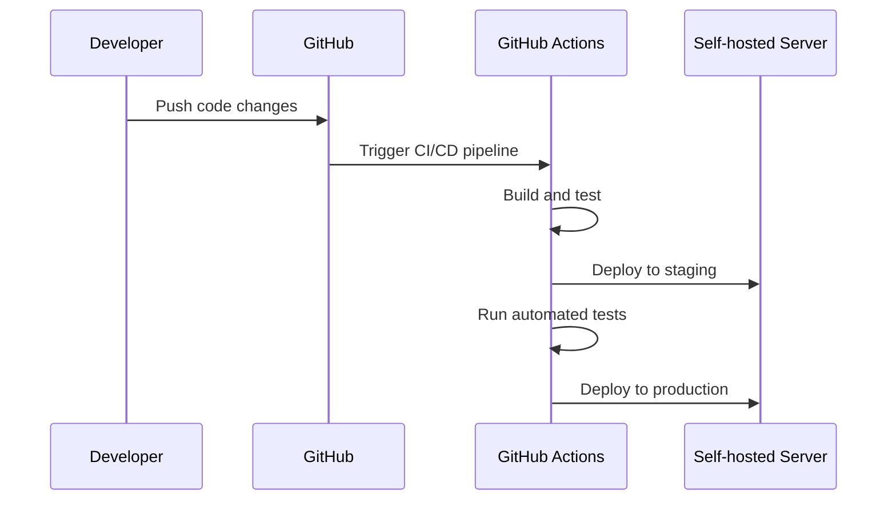

### Slide 6: Self-Hosted Supremacy: Crafting a Tailored DevOps Environment
- **Bullet Points**:
  - Infrastructure components: Docker, Kubernetes, Prometheus, Grafana, Vault
  - Scaling strategies: Horizontal and vertical scaling techniques
  - Security measures: Network isolation, access controls, and secret management
  - Monitoring and observability: Proactive identification and resolution of issues
- **Mermaid Diagram**: A component diagram showcasing the self-hosted infrastructure

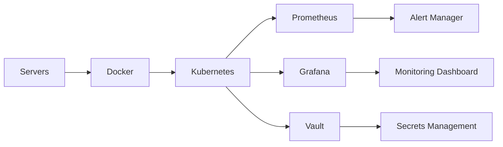

### Slide 7: Empowering Mobile DevOps: iOS Shortcuts and Working Copy
- **Bullet Points**:
  - iOS Shortcuts: Automating repetitive tasks and workflows
  - Working Copy: Git client for mobile devices
  - Real-world scenario: Triggering a deployment from a mobile device
  - Benefits: Flexibility, responsiveness, and improved collaboration
- **Mermaid Diagram**: A flowchart depicting a mobile-triggered deployment

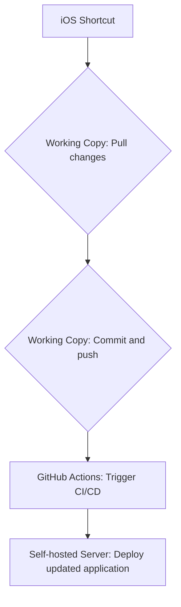

### Slide 8: Overcoming Obstacles: Challenges and Triumphs
- **Bullet Points**:
  - Challenge 1: Complexity of setup and management
    - Solution: Automation and documentation
    - Outcome: Streamlined processes and reduced manual effort
  - Challenge 2: Ensuring high availability and disaster recovery
    - Solution: Multi-region deployments and data replication
    - Outcome: Improved resilience and minimized downtime
  - Challenge 3: Skill gaps and learning curves
    - Solution: Continuous learning and knowledge sharing
    - Outcome: Enhanced team capabilities and faster adoption
- **Mermaid Diagram**: A timeline showcasing challenges and solutions

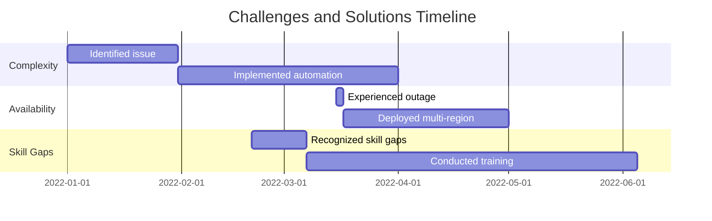

### Slide 9: Celebrating Success: Real-World Impact
- **Bullet Points**:
  - Case Study 1: Accelerated time-to-market for new features
    - Before: Manual processes and delays
    - After: Automated workflows and faster iterations
    - Results: X% reduction in release cycles
  - Case Study 2: Improved system reliability and uptime
    - Before: Frequent outages and performance issues
    - After: Self-healing infrastructure and proactive monitoring
    - Results: X% increase in uptime and customer satisfaction
  - Case Study 3: Enhanced collaboration and developer productivity
    - Before: Silos and inefficient communication
    - After: Streamlined workflows and mobile-friendly tools
    - Results: X% improvement in developer productivity metrics
- **Mermaid Diagram**: A radar chart comparing key metrics before and after

```mermaid
radar
    title Impact Metrics: Before vs. After
    "Time-to-Market" 3, 1
    "System Reliability" 2, 5
    "Developer Productivity" 2, 4
```

### Slide 10: Exploring New Frontiers: The Future of Our Infrastructure
- **Bullet Points**:
  - Continuous improvement: Iterating and refining our processes
  - Emerging technologies: Evaluating serverless, edge computing, and AI/ML
  - Collaboration and knowledge sharing: Contributing to the DevOps community
  - Scaling beyond: Applying lessons learned to other projects and teams
- **Mermaid Diagram**: A roadmap showcasing future initiatives

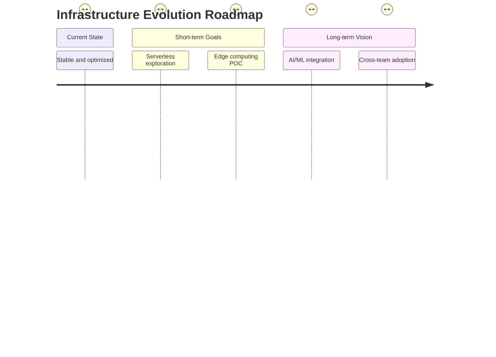

### Slide 11: Empowering the Audience: A Call to Action
- **Bullet Points**:
  - Key takeaways: The transformative power of GitOps, CI/CD, and self-hosting
  - Getting started: Practical tips and resources for adopting these practices
  - Collaboration invitation: Engaging with the speaker and the community
  - Challenge: Encouraging the audience to experiment and innovate
- **Mermaid Diagram**: A tree diagram illustrating the call-to-action steps

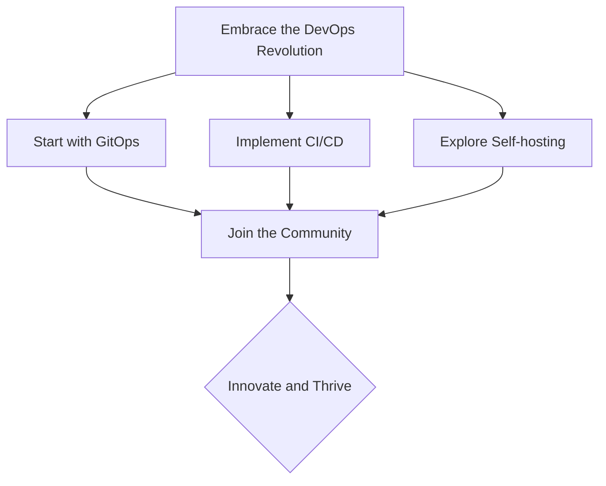

### Slide 12: Igniting Discussion: Q&A and Shared Insights
- **Bullet Points**:
  - Encouraging audience participation: Inviting questions and comments
  - Sharing additional insights: Addressing common challenges and concerns
  - Fostering connections: Promoting networking and knowledge exchange
  - Concluding remarks: Reinforcing the key messages and thanking the audience
- **Mermaid Diagram**: A mind map of potential discussion topics

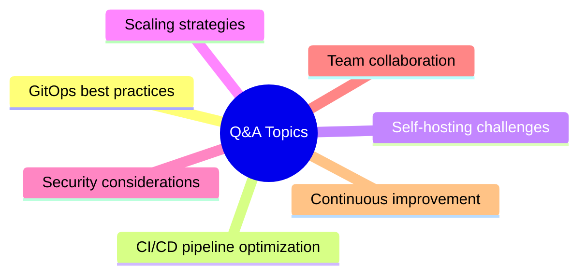

This enhanced outline provides more comprehensive bullet points for each slide, covering key aspects, real-world examples, and actionable insights. The suggested Mermaid diagrams offer visual representations of workflows, comparisons, timelines, and other relevant concepts, making the presentation more engaging and informative.

Remember to adapt the diagrams to your specific scenarios and data, and feel free to further refine the content based on your unique experiences and expertise. With this outline, you'll be well-prepared to deliver a compelling and inspiring talk on revolutionizing microservices with self-hosted, GitOps-driven infrastructure.