Sure, I'd be happy to expand on the presentation with bullet points and mermaid code for each slide. Here's the enhanced version:

Title: Revolutionizing Microservices with Self-Hosted, GitOps-Driven Infrastructure

Slide 1: Introduction
- Title: "The Journey to a Self-Sufficient, Agile DevOps Ecosystem"
- Content:
  - Introduction to David Cannan and his passion for leveraging technology
  - Goals of the talk: sharing design, implementation, and benefits of unique infrastructure
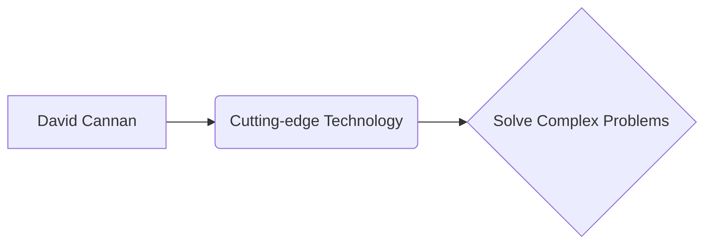

Slide 2: The Genesis of the Idea
- Title: "Why Go Self-Hosted in a Cloud-Dominant World?"
- Content:
  - Challenges faced with traditional cloud services
  - Vision to blend agility of cloud with control of self-hosting
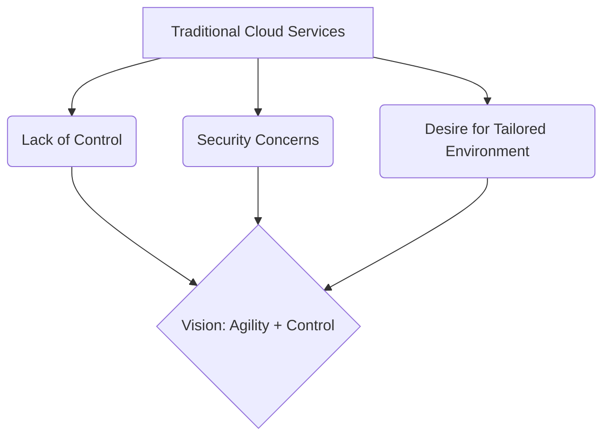

Slide 3: Core Principles
- Title: "Foundation Stones: GitOps, CI/CD, and Self-Hosting"
- Content:
  - GitOps for infrastructure automation
  - CI/CD for seamless development to deployment
  - Self-hosting for control and customization
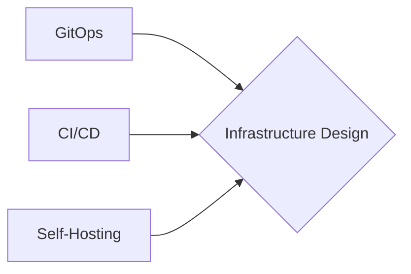

Slide 4: The Architecture Unveiled
- Title: "Architecting the Future: A Closer Look at Our Setup"
- Content:
  - GitHub as the epicenter for source control and collaboration
  - GitHub Actions for CI/CD
  - Interaction with self-hosted servers
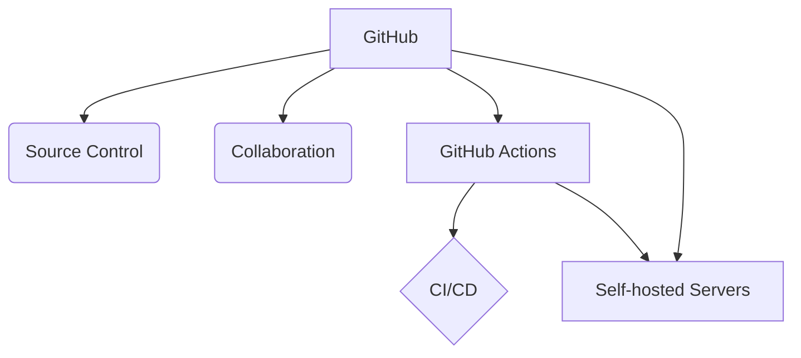

Slide 5: Deep Dive: GitOps and GitHub Actions
- Title: "Automate Everything: Leveraging GitHub Actions for GitOps"
- Content:
  - Examples of using GitHub Actions for automation
  - Benefits of GitOps for consistency, traceability, and efficiency
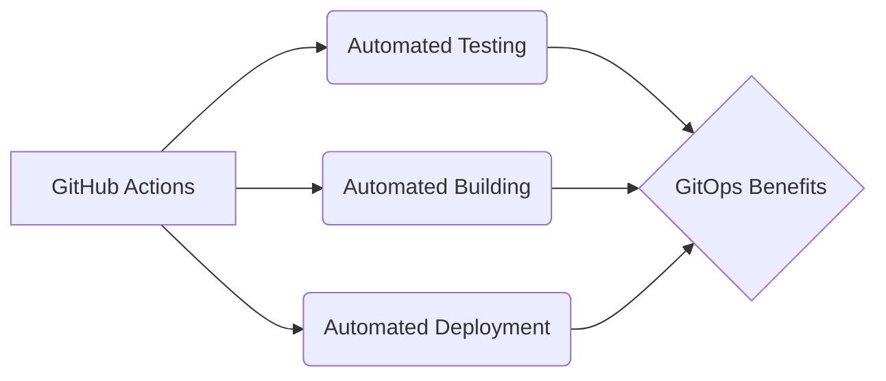

Slide 6: The Self-Hosted Advantage
- Title: "Control, Security, and Scalability: The Self-Hosted Advantage"
- Content:
  - Setup of on-premise infrastructure
  - Docker Swarm/Kubernetes for orchestration
  - Prometheus & Grafana for monitoring
  - Vault for secret management
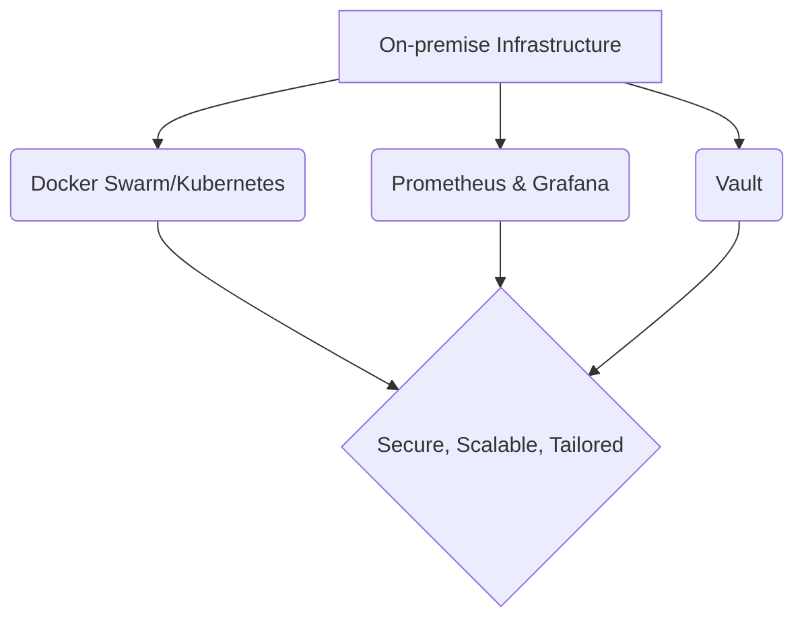

Slide 7: Mobile Management Magic
- Title: "On-the-Go Operations: iOS Shortcuts and Working Copy"
- Content:
  - Managing repositories and CI/CD pipelines using iOS Shortcuts and Working Copy
  - Ensuring operational flexibility and efficiency from anywhere
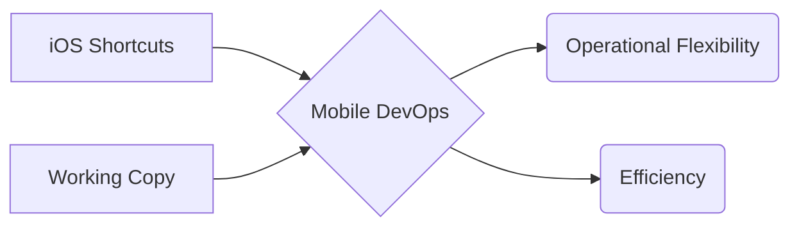

Slide 8: Challenges and Solutions
- Title: "Roadblocks and Reroutes: Overcoming Infrastructure Challenges"
- Content:
  - Challenges faced: complexity, learning curves, robust security needs
  - Addressing challenges through collaboration and iteration
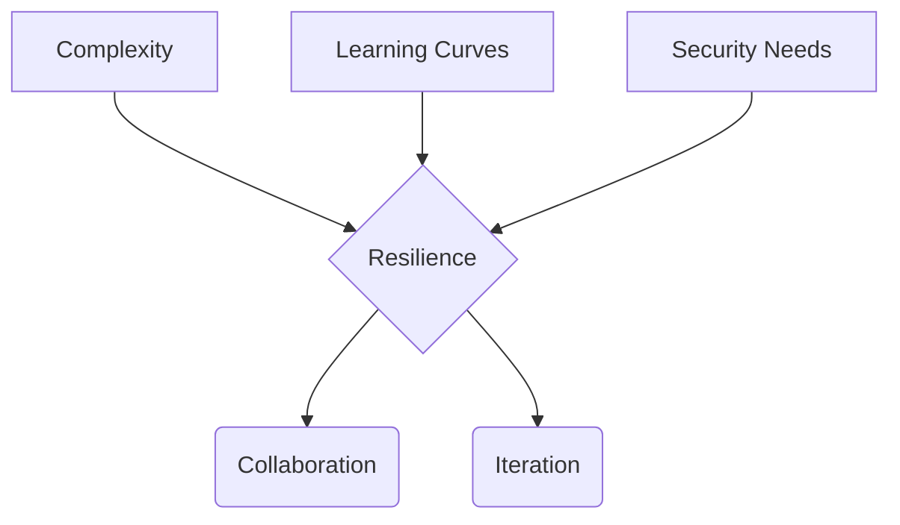

Slide 9: Success Stories
- Title: "From Theory to Triumph: Real-World Success Stories"
- Content:
  - Case studies or examples illustrating effectiveness of setup
  - Enhancing productivity, ensuring security, enabling rapid deployments
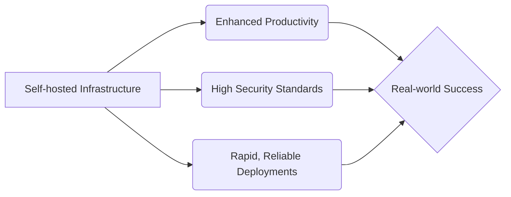

Slide 10: The Road Ahead
- Title: "Future Paths: Evolution of Our Infrastructure"
- Content:
  - Upcoming enhancements and potential integrations
  - Areas of exploration for refining and evolving infrastructure
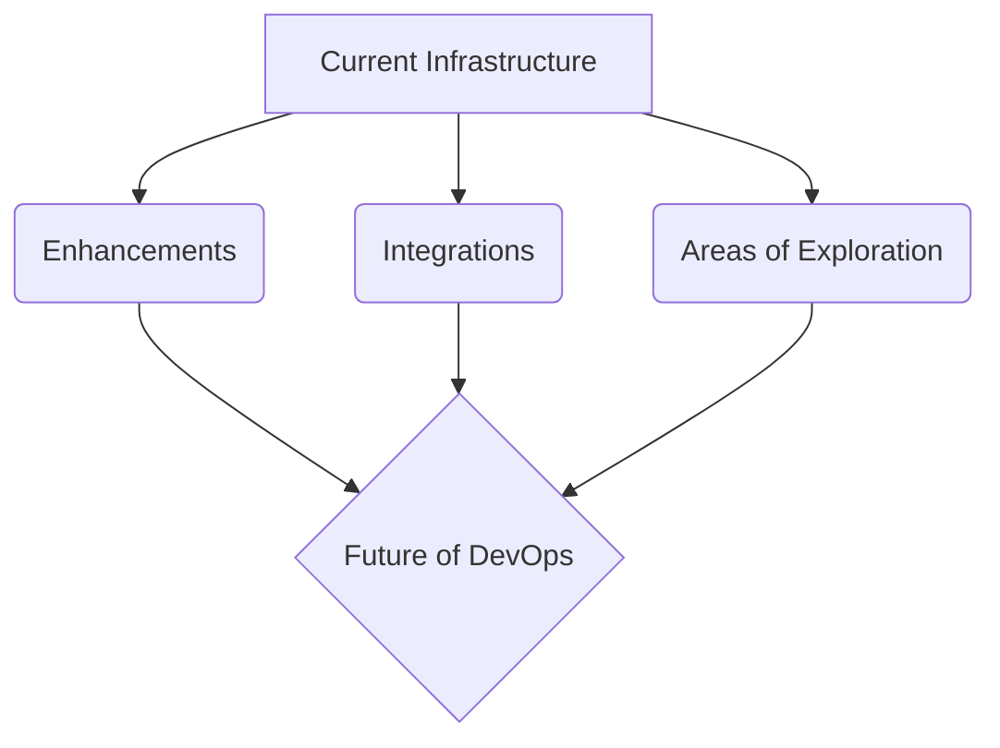

Slide 11: Engage and Inspire
- Title: "Join the Revolution: Engage, Experiment, Evolve"
- Content:
  - Call to action: explore GitOps, self-hosting, mobile management
  - Encourage audience to follow work, contribute, start their journey
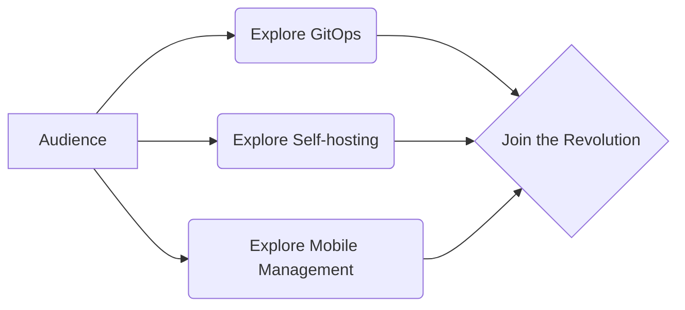

Slide 12: Q&A
- Title: "Let's Discuss: Your Questions, My Insights"
- Content:
  - Open floor for questions
  - Offer insights and experiences to address audience's curiosities and challenges
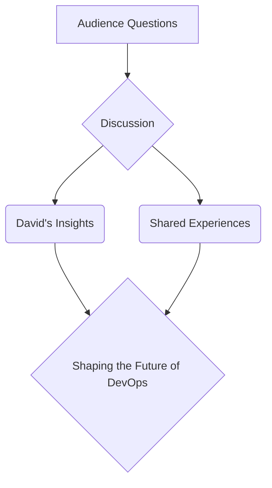

This expanded version provides more visual context with the mermaid diagrams, illustrating the key points and relationships for each slide. The bullet points offer a structured overview of the content, while the diagrams add a layer of visual engagement and clarity for the audience.