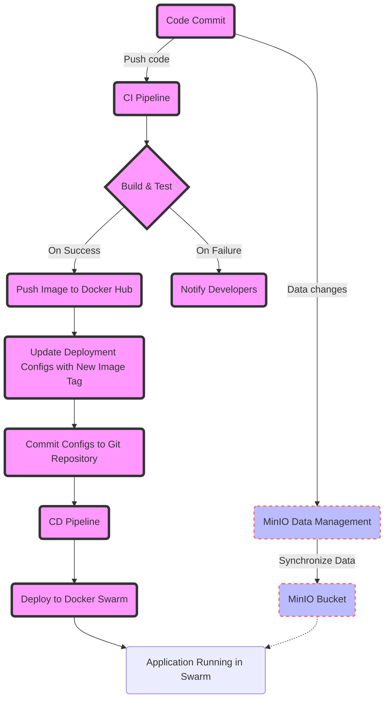

For the article focusing on GitOps using the project from our discussion as an example, let's create a Mermaid diagram that visually represents the workflow. This diagram will showcase the integration of GitOps principles, MinIO for object storage, and the deployment process via Docker Swarm, all within a CI/CD pipeline facilitated by GitHub Actions.

The diagram will illustrate the following key steps:
1. **Code Commit**: Developers push code to the repository.
2. **CI Pipeline**: GitHub Actions trigger the CI pipeline upon code commit.
3. **Build & Test**: The CI pipeline builds the Docker image and runs tests.
4. **Push Image**: Upon successful tests, the image is pushed to Docker Hub.
5. **Update Configs**: The CI pipeline updates deployment configs with the new image tag.
6. **Commit Configs**: The updated configs are committed back to the Git repository.
7. **CD Pipeline**: Changes to configs trigger the CD pipeline.
8. **Deploy to Swarm**: The CD pipeline deploys the new image to Docker Swarm.
9. **MinIO Data Management**: Parallel to CI/CD, data management workflows synchronize datasets and model artifacts with MinIO.

Here's the Mermaid code that represents this workflow:

### How to Interpret the Diagram:

- **gitops** class (in pink): Represents steps directly involved in the GitOps CI/CD pipeline, from code commits to deployment.
- **minio** class (in blue): Illustrates the MinIO data management process, highlighting its role in handling data outside the CI/CD pipeline but essential for the application's operation.
- Dotted lines indicate data synchronization with MinIO, supporting the running application with necessary datasets and artifacts.

This Mermaid diagram provides a visual understanding of how GitOps principles are applied within the project, showcasing the integration of MinIO for object storage and the seamless deployment process via Docker Swarm. It helps illustrate the article's discussion points, making complex workflows understandable at a glance.