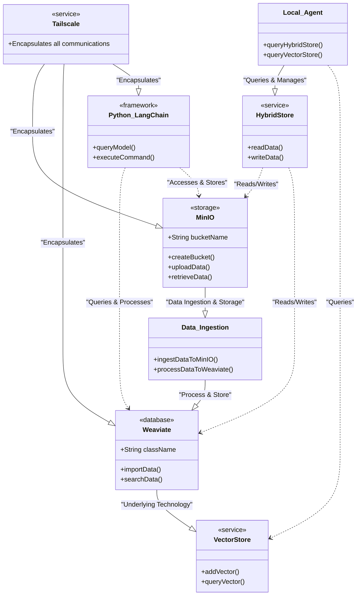
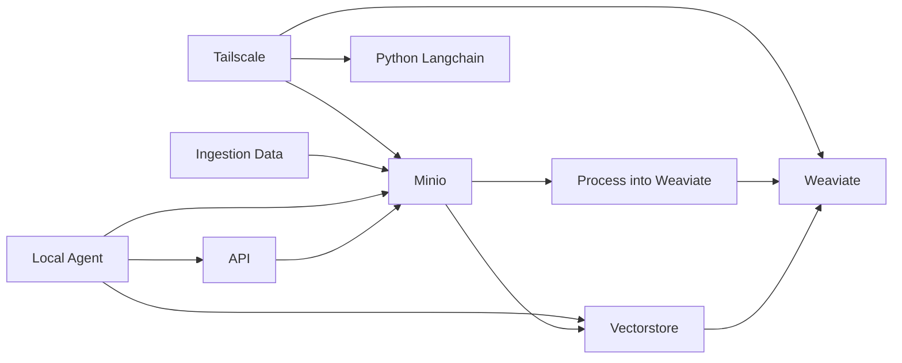
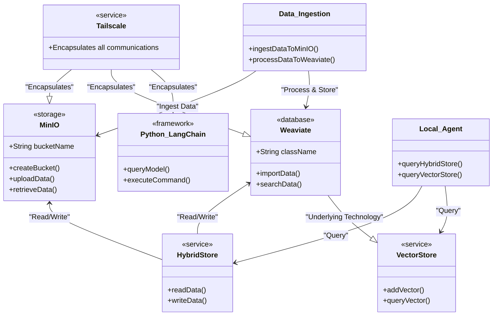
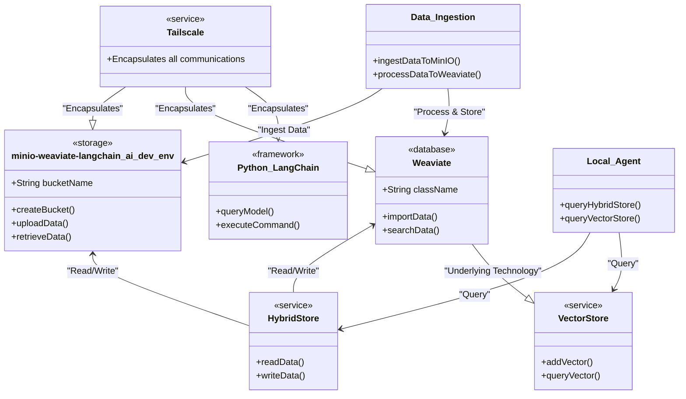

Here's the updated Mermaid diagram with the requested change:

Explanation:
- The `MinIO` class has been renamed to `minio-weaviate-langchain_ai_dev_env` to represent the development environment for MinIO, Weaviate, and LangChain AI.
- All other components and their relationships remain the same as in the previous diagram.

This diagram incorporates the requested change while maintaining the overall structure and data flow of your architecture.
