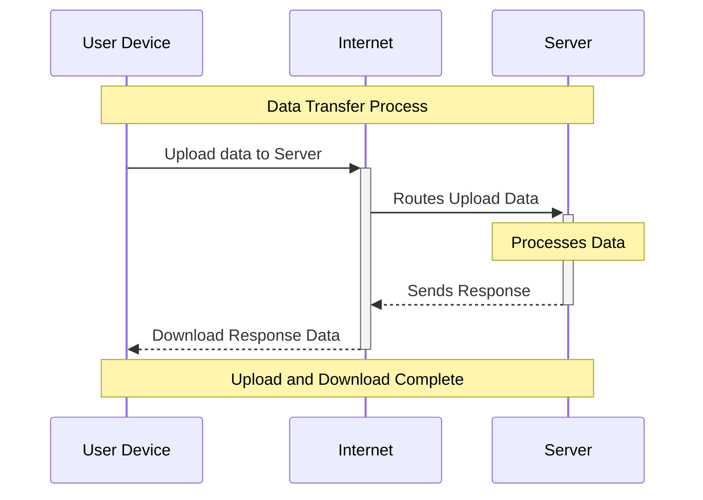
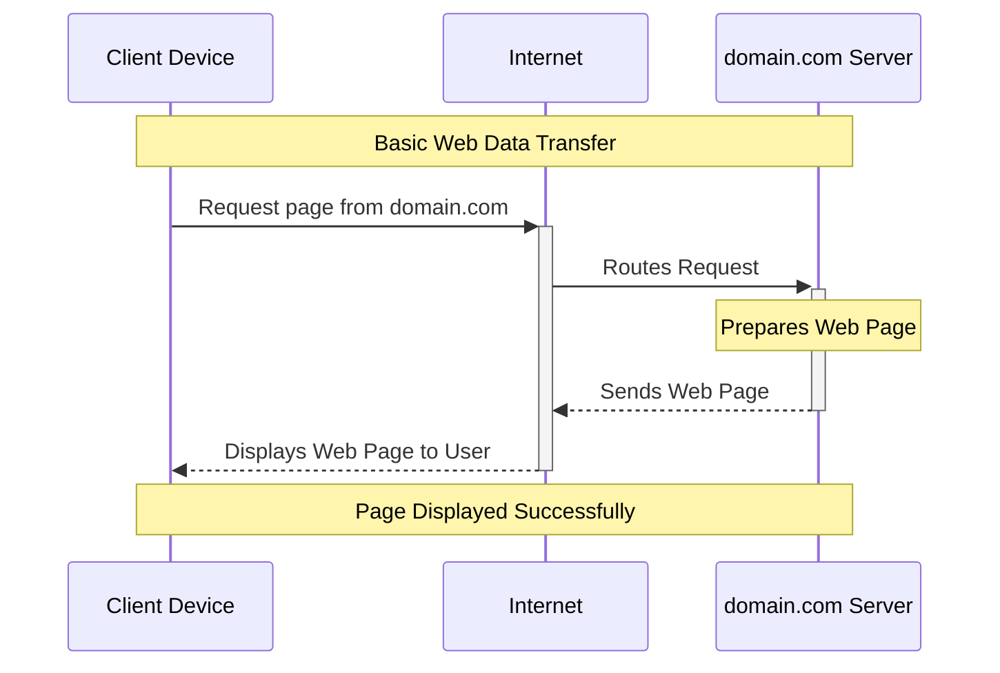
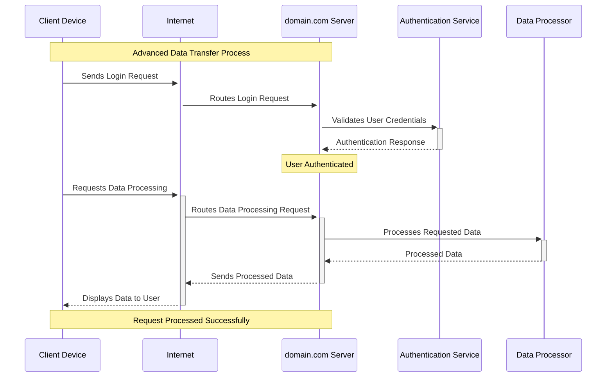
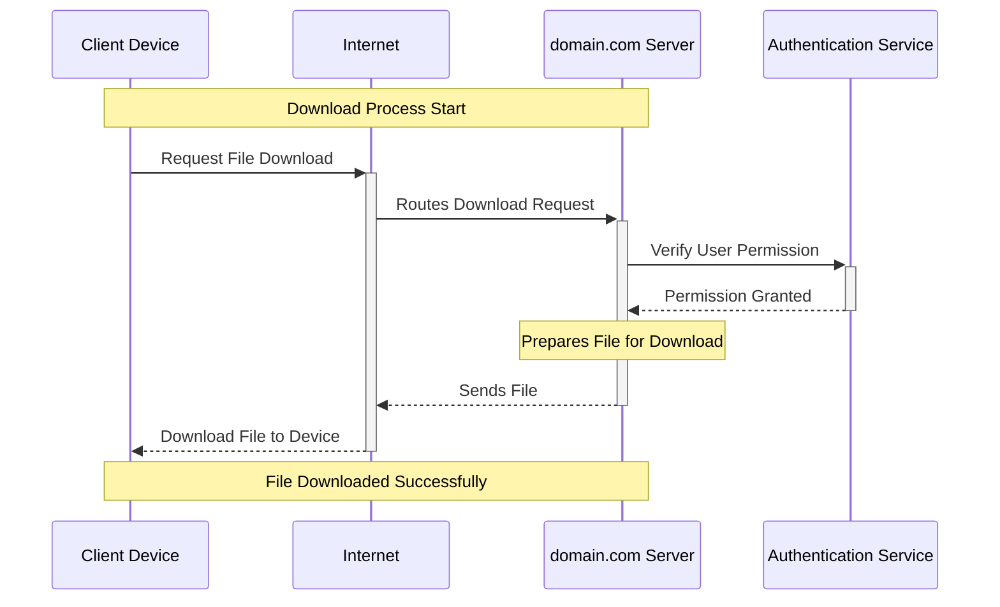

Let's adapt the provided sequence diagram to include a specific example involving `domain.com` and demonstrate a more complex instance involving additional steps or elements such as authentication and data processing. First, we'll update the diagram for a basic web interaction with `domain.com`.

### Basic Web Interaction with domain.com

This diagram focuses on a straightforward web page request process where the client device requests a page, and `domain.com` server processes and responds with the page data.

### Advanced Interaction with Authentication and Data Processing

For a more complex scenario, let’s incorporate steps involving user authentication and some data processing before the server sends a response back.

This advanced sequence diagram adds:

- **Authentication**: The client device sends a login request, which the server routes to an authentication service. The service verifies the user's credentials and sends a response back.
- **Data Processing**: After successful authentication, the client requests data processing. The server forwards this request to a data processor, which processes and returns the data to the server. Finally, the server sends the processed data back to the client device for display.

These diagrams illustrate both a simple web page request and a more complex interaction involving authentication and data processing, providing a clear narrative of the steps involved in each process.

For a scenario focused on downloading data from a server, such as `domain.com`, we can illustrate a sequence where the user requests a specific file or data, and the server processes and sends this data back to the client device. This sequence will highlight the steps involved in requesting, processing, and successfully downloading data.

### Download Process from a Server

This diagram represents the steps for a file download process:

1. **Request File Download**: The client device initiates the process by requesting to download a file from `domain.com`.
2. **Routes Download Request**: The internet routes this request to the server hosting the domain.
3. **Verify User Permission**: The server checks with an authentication service to verify if the user has the necessary permissions to download the file.
4. **Permission Granted**: Upon successful verification, the server is informed that permission is granted.
5. **Prepares File for Download**: The server prepares the requested file for download. This can involve gathering the file data, possibly compressing it, and making it ready for transmission.
6. **Sends File**: The server sends the file across the internet to the client device.
7. **Download File to Device**: The client device receives the file and completes the download process.

This sequence diagram concisely illustrates the interactions and steps involved in downloading a file from a server, emphasizing authentication and the transfer process.