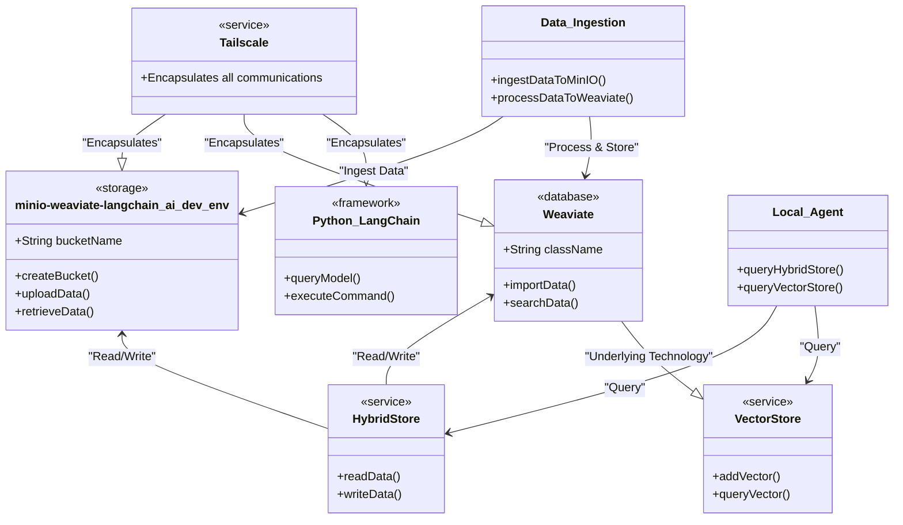

Explanation:
- The `MinIO` class has been renamed to `minio-weaviate-langchain_ai_dev_env` to represent the development environment for MinIO, Weaviate, and LangChain AI.
- All other components and their relationships remain the same as in the previous diagram.
