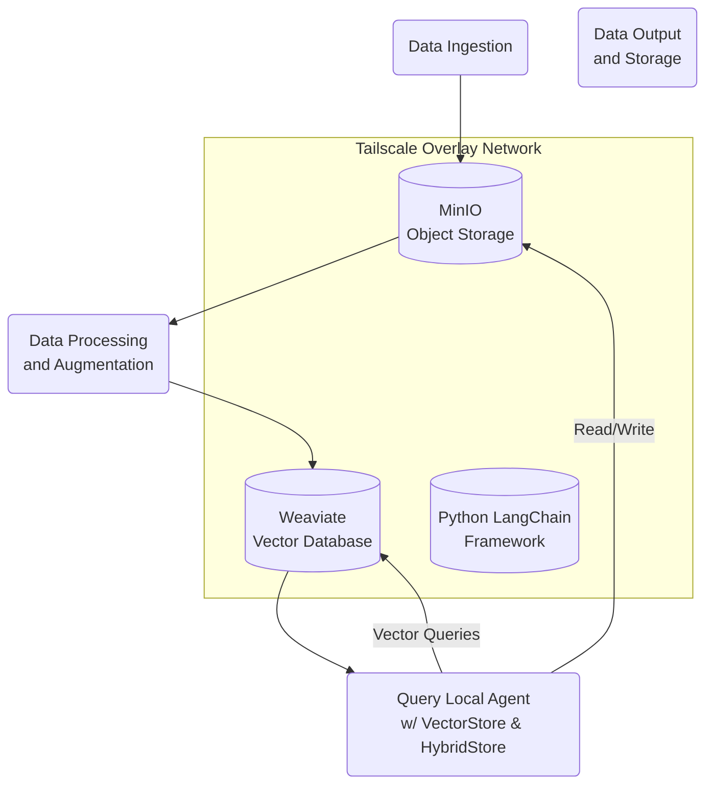

For representing the infrastructure and workflows you’re implementing with Tailscale, MinIO, Weaviate, and Python LangChain, a more suitable Mermaid diagram might be a flowchart. Flowcharts excel at depicting processes and the flow of data between components, making them ideal for illustrating how data is ingested, processed, queried, and stored within your setup. This approach can more clearly communicate the operational dynamics and interactions among your services.

Here’s a Mermaid flowchart diagram that represents the flow of data in your project, highlighting the role of Tailscale as an overlay network and how it integrates with your other components:

Diagram Explanation

- Tailscale Overlay Network: This is represented as a containing subgraph that encapsulates MinIO, Weaviate, and Python LangChain. It highlights Tailscale’s role in providing secure, encrypted connectivity for the components within your infrastructure.

Data Flow:
- Data Ingestion: The starting point where data is ingested into the system, potentially through various sources like IoT devices, web scrapers, or manual uploads.
- MinIO Object Storage: Acts as the primary storage for ingested data, leveraging MinIO for its high-performance, S3-compatible object storage capabilities.
- Data Processing and Augmentation: Data is then processed, which might involve transformation, analysis, or augmentation. This step leverages the capabilities of Weaviate for vector-based processing or other AI/ML operations provided by Python LangChain.
- Query Local Agent with VectorStore & HybridStore: Represents querying operations through a local agent that interfaces with both MinIO and Weaviate. This step involves complex queries that leverage Weaviate’s vector search and MinIO’s durable object storage.
- Data Output and Storage: The final step where processed data is stored back in MinIO or Weaviate, ensuring that results are persistently stored and easily accessible for further use or analysis.

This flowchart clearly illustrates the pathways of data through your system, from ingestion to processing and querying, under the secure umbrella of the Tailscale overlay network. It provides a visual representation of the infrastructure’s operation, focusing on the flow and transformation of data within the network.